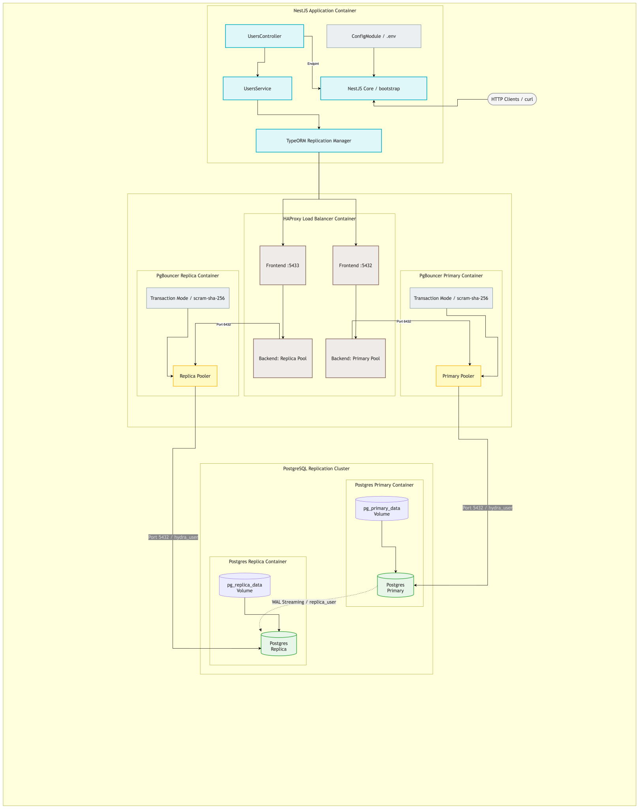

# Database Horizontal Scaling with NestJS/Go, PgBouncer, HAProxy, and PostgreSQL Replication

This project details the setup of a horizontally scaled PostgreSQL database architecture (Primary/Replica) with Patroni clustering, PgBouncer connection poolers, HAProxy load balancer routing, and two containerized services:
1. **NestJS Application** (running on port `3000`) using TypeORM replication.
2. **Go Gin Application** (running on port `8080`) using GORM and GORM DBResolver.

---

## 🏗️ Architecture Diagram

The system consists of the following components:



---

## 📂 Project Structure

The project structure is organized as follows:

```
hydradb/
├── docker-compose.yml    # Root Composition Orchestration
├── run-load-test.sh      # Cluster Performance Load Test Script
├── README.md             # Project Documentation
├── .gitignore            # Root Git ignore rules
├── docker/               # Base Cluster Configurations
│   ├── haproxy/          # HAProxy Port Load Balancers Config
│   ├── pgbouncer/        # Connection Poolers Config
│   └── postgres/         # Patroni/Postgres Replica Templates
├── nestapp/              # NestJS Application (Port 3000)
│   ├── src/              # TypeORM Models, Controllers & Services
│   ├── test/             # e2e Testing Packages
│   ├── .env              # Local Environment configuration
│   ├── .env.example      # Env templates
│   ├── .gitignore        # NestJS local Git ignores
│   └── Dockerfile        # NestJS build specifications
└── goapp/                # Go Gin Application (Port 8080)
    ├── main.go           # Gin API Endpoints & GORM DBResolver setup
    ├── go.mod            # Go Module dependencies
    ├── .env              # Local Environment configuration (PORT=3000)
    ├── .env.example      # Env templates
    ├── Dockerfile        # Go multi-stage build specifications
    ├── views/
    │   └── index.html    # Frontend User Dashboard HTML
    ├── assets/           # Dashboard static topology images
    └── docs/             # Interactive Swagger UI pages
```

---

## 🛠️ Key Components & Design

1. **PostgreSQL Replication & Patroni**:
   - `pg_primary` (Write leader) streams Write-Ahead Logs (WAL) to `pg_replica` (Standby replica).
   - Patroni orchestrates high availability and coordinates leader state using `etcd`.
2. **PgBouncer**:
   - Manages connection pools for both database instances independently using `transaction` pooling mode to prevent database connection exhaustion.
3. **HAProxy**:
   - Exposes port `5432` for write traffic (routing to primary PgBouncer).
   - Exposes port `5433` for read traffic (routing to replica PgBouncer).
4. **Application Segregation (TypeORM & GORM DBResolver)**:
   - Both NestJS and Go applications automatically route write operations (`POST /users`) to the primary database (`HAProxy:5432`).
   - Both applications automatically route read operations (`GET /users`) to the replica database (`HAProxy:5433`).
   - Diagnostic endpoints (`GET /users/db-info`) query both endpoints explicitly to return replica/master database server status.

---

## 🚀 Setup & Execution

### Prerequisites
- Docker Desktop / Daemon running
- Go (optional, for local development under `goapp/`)
- Node.js & Yarn (optional, for local development under `nestapp/`)

### 1. Startup Cluster
Start all services in detached mode:
```bash
docker compose up --build -d
```
This spins up:
- etcd server (`etcd`)
- PostgreSQL primary database (`pg_primary`)
- PostgreSQL replica database (`pg_replica`)
- PgBouncer for primary (`pgbouncer_primary`)
- PgBouncer for replica (`pgbouncer_replica`)
- HAProxy load balancer (`haproxy`)
- NestJS application (`nestjs_app`) on port `3000`
- Go Gin application (`go_app`) on port `8080`

Connected together through a custom bridge network `hydra_net`.

---

## 🧪 Verification & Testing

### 1. Check Service Health
Confirm that all containers are healthy and running:
```bash
docker compose ps
```

### 2. Verify Database Replication
Log into `pg_replica` directly to confirm it is operating in replica/recovery mode:
```bash
docker compose exec pg_replica psql -U postgres -d hydra_db -c "SELECT pg_is_in_recovery();"
```

### 3. Test API Endpoints

Both services expose identical APIs:

#### NestJS Service (Port 3000)
- **Perform a Write (routes to Master/Primary):**
  ```bash
  curl -X POST http://localhost:3000/users \
       -H "Content-Type: application/json" \
       -d '{"name": "Nest User", "email": "nest@example.com"}'
  ```
- **Perform a Read (routes to Slave/Replica):**
  ```bash
  curl http://localhost:3000/users
  ```
- **Check Connection Info Routing:**
  ```bash
  curl http://localhost:3000/users/db-info
  ```

#### Go Gin Service (Port 8080)
- **Perform a Write (routes to Master/Primary):**
  ```bash
  curl -X POST http://localhost:8080/users \
       -H "Content-Type: application/json" \
       -d '{"name": "Go User", "email": "go@example.com"}'
  ```
- **Perform a Read (routes to Slave/Replica):**
  ```bash
  curl http://localhost:8080/users
  ```
- **Check Connection Info Routing:**
  ```bash
  curl http://localhost:8080/users/db-info
  ```

---

## 📊 Benchmarking & Load Testing

The included `run-load-test.sh` script tests read and write throughput using `autocannon`. You can target either port:

```bash
chmod +x run-load-test.sh

# Load test NestJS (Port 3000)
./run-load-test.sh 10 100 3000

# Load test Go Gin (Port 8080)
./run-load-test.sh 10 100 8080
```
